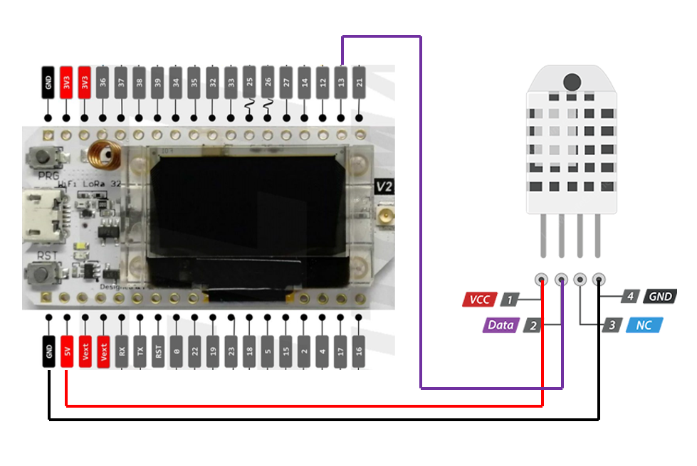
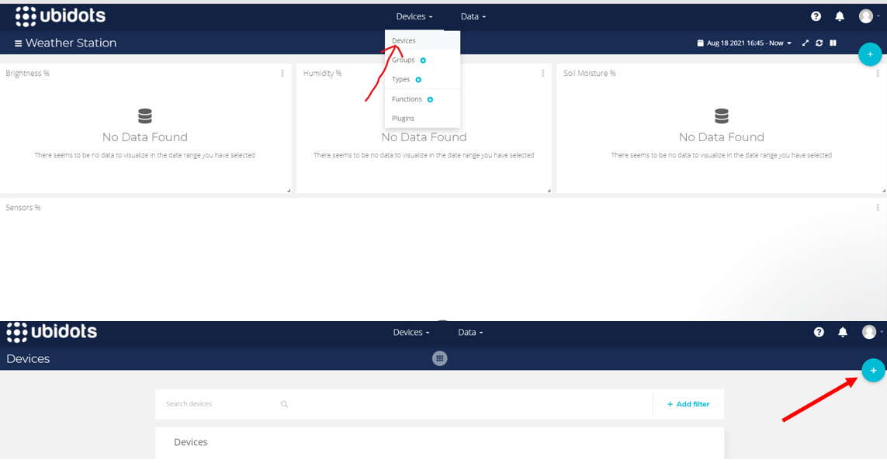
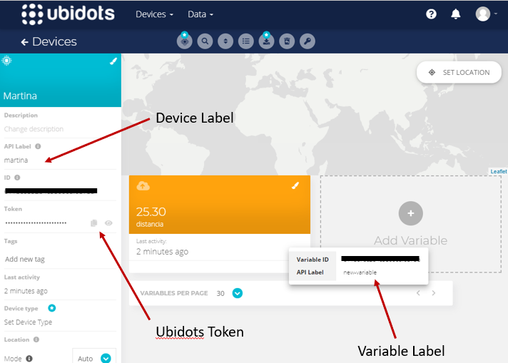

# 2HeltecLoRa_Sender_Receiver_WifiUbidots
The aim of this repository is to show how to use a Heltec WIFI LoRa 32 (V2) to transmit data from a temperature sensort type DHT22 over LoRa to another Heltec Board and to publish the data over MQTT using the WIFI of the receiver, to publish the data on Ubidots.
## All you need
- [2 Heltec WIFI LoRa 32(V2)](https://www.amazon.com/-/es/desarrollo-Bluetooth-pantalla-inteligentes-fabricantes/dp/B076MSLFC9/ref=sr_1_4?__mk_es_US=%C3%85M%C3%85%C5%BD%C3%95%C3%91&crid=JBTNPPC43UW4&dchild=1&keywords=heltec%2Blora%2B32%2Bv2&qid=1629408658&sprefix=heltec%2Blora%2Caps%2C195&sr=8-4&th=1)
- [Temperature and Humidity Sensor DHT22](https://www.amazon.com/temperatura-Monitores-reemplazar-electr%C3%B3nica-pr%C3%A1ctica/dp/B0795F19W6/ref=sr_1_1_sspa?__mk_es_US=%C3%85M%C3%85%C5%BD%C3%95%C3%91&dchild=1&keywords=DHT22&qid=1629408809&sr=8-1-spons&psc=1&spLa=ZW5jcnlwdGVkUXVhbGlmaWVyPUEyRzVVN0YwT05DN05NJmVuY3J5cHRlZElkPUExMDE1NzIzMzBZVzlWSTc5TVBYMyZlbmNyeXB0ZWRBZElkPUEwODg1MTA4MkU5WTlBSERCN05aMiZ3aWRnZXROYW1lPXNwX2F0ZiZhY3Rpb249Y2xpY2tSZWRpcmVjdCZkb05vdExvZ0NsaWNrPXRydWU=) 
## Wiring Diagram

## Before uploading the code 
- Create an account in [Ubidots](https://ubidots.com/).
- Then click on devices and create a new device.

- After, choose blank device and enter a device name and label.
- Enter into your new device and click on "Add Variable".
- Finally, save your credentials for next step.

## Uploading Code
- Open the Reciever code, enter the credentials from ubidots, wifi name and password 
- Upload the code to one developer board 
- Finally upload the Sender code to the other board. 
